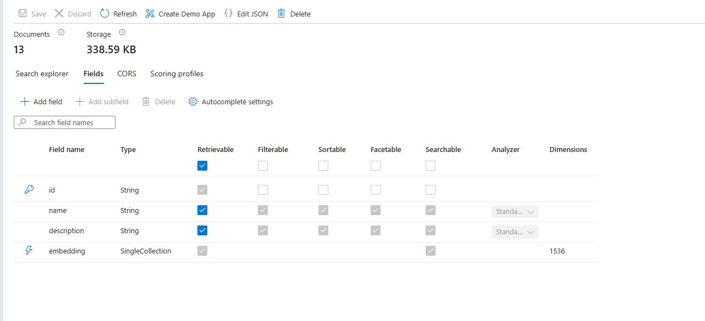

# Integrate Open AI Services with Cosmos DB: RAG pattern

This repository provides a demo showcasing the usage of the RAG pattern for integrating Azure Open AI services with custom data in Azure Cosmos DB. The goal is to limit the responses from Open AI services based on recipes stored in Cosmos DB.

### Prerequisites

- Azure Cosmos DB NoSQL Account
    - Create a DataBase and Container with 1000 RU/sec Autoscale provisioned throughput
- Azure Open AI Service
    - Deploy text-davinci-003 model for Embeding
    - Deploy gpt-35-turbo model for Chat Completion
- Azure Cognitive Search Account


### Installation
``` bash 
cd OpenAICognitiveSearch
mvn compile exec:java
```

### Run

Before running the application, you need to set environment variables. Either export them in command line or set system variables:

```bash
    export COSMOS_URI="URI of your Cosmos DB account"
    export COSMOS_KEY="KEY of your Cosmos DB account"
    export COSMOS_DATABASE="name of a database you have created"
    export COSMOS_CONTAINER="name of a container in above database, partitioned by id"
    export RECIPE_LOCAL_FOLDER="the full path to the Recipe folder in this project e.g. C:CosmosDemo\OpenAICognitiveSearch\Recipe"
    export OPENAI_ENDPOINT="endpoint for your Azure OpenAI account"
    export OPENAI_KEY="key for your Azure OpenAI account"
    export OPENAI_EMBEDDING_DEPLOYMENT="deployment id for your Azure OpenAI chat embeddings"
    export OPENAI_COMPLETIONS_DEPLOYMENT="deployment is for your Azure OpenAI chat completions"
    export SEARCH_SERVICE_ENDPOINT="Azure Cognitive Search service endpoint"
    export SEARCH_INDEX_NAME="Choose a search index name - you will use this when creating the index"
```

Then run the app:

```bash
mvn exec:java   
```

## Getting Started
When you run the application for the first time, it will connect to Cosmos DB and report that there are no recipes available, as we have not uploaded any recipes yet.
To begin, follow these steps:

1) **Upload Documents to Cosmos DB:** Select the first option in the application and hit enter. This option reads documents from the local machine and uploads the JSON files to the Cosmos DB NoSQL account.

2) **Create Azure Cognitive Search Index:** 

Create an index for Cosmos DB in Azure Search, and be sure to give it the same name that you set in environment variables above.

<details>
<summary>Click to show/hide Cognitive Search Index fields json</summary>

``` json
{
  "name": "recipeindex",
  "defaultScoringProfile": null,
  "fields": [
    {
      "name": "id",
      "type": "Edm.String",
      "searchable": false,
      "filterable": false,
      "retrievable": true,
      "sortable": false,
      "facetable": false,
      "key": true,
      "indexAnalyzer": null,
      "searchAnalyzer": null,
      "analyzer": null,
      "normalizer": null,
      "dimensions": null,
      "vectorSearchConfiguration": null,
      "synonymMaps": []
    },
    {
      "name": "name",
      "type": "Edm.String",
      "searchable": true,
      "filterable": true,
      "retrievable": true,
      "sortable": true,
      "facetable": true,
      "key": false,
      "indexAnalyzer": null,
      "searchAnalyzer": null,
      "analyzer": "standard.lucene",
      "normalizer": null,
      "dimensions": null,
      "vectorSearchConfiguration": null,
      "synonymMaps": []
    },
    {
      "name": "description",
      "type": "Edm.String",
      "searchable": true,
      "filterable": true,
      "retrievable": true,
      "sortable": true,
      "facetable": true,
      "key": false,
      "indexAnalyzer": null,
      "searchAnalyzer": null,
      "analyzer": "standard.lucene",
      "normalizer": null,
      "dimensions": null,
      "vectorSearchConfiguration": null,
      "synonymMaps": []
    },
    {
      "name": "embedding",
      "type": "Collection(Edm.Single)",
      "searchable": true,
      "filterable": false,
      "retrievable": true,
      "sortable": false,
      "facetable": false,
      "key": false,
      "indexAnalyzer": null,
      "searchAnalyzer": null,
      "analyzer": null,
      "normalizer": null,
      "dimensions": 1536,
      "vectorSearchConfiguration": "my-vector-config",
      "synonymMaps": []
    }
  ],
  "scoringProfiles": [],
  "corsOptions": null,
  "suggesters": [],
  "analyzers": [],
  "normalizers": [],
  "tokenizers": [],
  "tokenFilters": [],
  "charFilters": [],
  "encryptionKey": null,
  "similarity": {
    "@odata.type": "#Microsoft.Azure.Search.BM25Similarity",
    "k1": null,
    "b": null
  },
  "semantic": null,
  "vectorSearch": {
    "algorithmConfigurations": [
      {
        "name": "my-vector-config",
        "kind": "hnsw",
        "hnswParameters": {
          "metric": "cosine",
          "m": 4,
          "efConstruction": 400,
          "efSearch": 500
        }
      }
    ]
  }
}
```
</details>

3) **Vectorize and Upload Recipes to Azure Cognitive Search:** The JSON data uploaded to Cosmos DB is not yet ready for efficient integration with Open AI. To use the RAG pattern, we need to find relevant recipes from Cosmos DB. Embeddings help us achieve this. To accomplish the task, we will utilize the vector search capability in Azure Cognitive Search to search for embeddings. Firstly, create the required vector search index in Azure Cognitive Search. Then, vectorize the recipes and upload the vectors to Azure Cognitive Search. Additionally, save them into Cosmos DB for future use. Selecting the second option in the application will perform all these activities.


#### Creating  a Search Index Client for Azure Cognitive Search
<details>
<summary>Click to show/hide</summary>

``` java
    private SearchIndexClient createSearchIndexClient() {
        String searchServiceEndPoint = AppConfig.searchServiceEndPoint;
        String adminApiKey = AppConfig.searchServiceAdminApiKey;

        return new SearchIndexClientBuilder()
                .endpoint(searchServiceEndPoint)
                .credential(new AzureKeyCredential(adminApiKey))
                .buildClient();
    }

```

</details>

####  Build the Vector Index in Azure Cognitive Search
<details>
<summary>Click to show/hide</summary>

``` Java
    private void createIndex(String indexName) {
        indexClient.createOrUpdateIndex(buildVectorSearchIndex(indexName));
    }

    private SearchIndex buildVectorSearchIndex(String name) {
        String vectorSearchConfigName = "my-vector-config";

        SearchIndex searchIndex = new SearchIndex(name);
        VectorSearch vectorSearch = new VectorSearch();
        vectorSearch.setAlgorithmConfigurations(List.of(new HnswVectorSearchAlgorithmConfiguration(vectorSearchConfigName)));

        searchIndex.setVectorSearch(vectorSearch);
        SemanticSettings semanticSettings = new SemanticSettings();
        PrioritizedFields prioritizedFields = new PrioritizedFields();

        SemanticField titleField = new SemanticField();
        titleField.setFieldName("name");

        prioritizedFields.setTitleField(titleField);
        SemanticField contentField = new SemanticField();
        contentField.setFieldName("description");
        prioritizedFields.setPrioritizedContentFields(List.of(contentField));

        semanticSettings.setConfigurations(List.of(new SemanticConfiguration(MY_SEMANTIC_CONFIG, prioritizedFields)));
        searchIndex.setSemanticSettings(semanticSettings);

        SearchField idSearchField = new SearchField("id", SearchFieldDataType.STRING);
        idSearchField.setKey(true);
        idSearchField.setFilterable(true);
        idSearchField.setSortable(true);

        SearchField nameSearchField = new SearchField("name", SearchFieldDataType.STRING);
        nameSearchField.setFilterable(true);
        nameSearchField.setSortable(true);
        nameSearchField.setSearchable(true);

        SearchField descSearchField = new SearchField("description", SearchFieldDataType.STRING);
        descSearchField.setFilterable(true);
        descSearchField.setSearchable(true);

        SearchField embedingSearchField = new SearchField("embedding", SearchFieldDataType.collection(SearchFieldDataType.SINGLE));
        embedingSearchField.setSearchable(true);
        embedingSearchField.setVectorSearchDimensions(1536);
        embedingSearchField.setVectorSearchConfiguration(vectorSearchConfigName);
        
        searchIndex.setFields(List.of(
          idSearchField,
          nameSearchField,
          descSearchField,
          embedingSearchField
        ));

        return searchIndex;
        }

```
</details>

#### Initialize the Azure Open AI SDK
<details>
<summary>Click to show/hide</summary>

``` Java
    public OpenAIService( String endpoint,
                          String key,
                          String embeddingsDeployment,
                          String completionDeployment,
                          int maxTokens) {
    
        this.openAIEmbeddingDeployment = embeddingsDeployment;
        this.openAICompletionDeployment = completionDeployment;
        this.openAIMaxTokens = maxTokens;

        RetryOptions retryOptions = new RetryOptions(
          new ExponentialBackoffOptions()
            .setMaxRetries(10)
            .setMaxDelay(Duration.of(2, ChronoUnit.SECONDS))
        );

        if (endpoint.contains("openai.azure.com")) {
          this.openAIClient = new OpenAIClientBuilder()
            .endpoint(endpoint)
            .credential(new AzureKeyCredential(key))
            .retryOptions(retryOptions)
            .buildAsyncClient();
        } else {
          this.openAIClient = new OpenAIClientBuilder()
            .endpoint(endpoint)
            .credential(new NonAzureOpenAIKeyCredential(key))
            .retryOptions(retryOptions)
            .buildAsyncClient();
        }
    }

```   
</details>

#### Generate Embedings using Open AI Service
<details>
<summary>Click to show/hide</summary>

``` Java
    public List<Double> getEmbeddings(String query) {
        try {
            EmbeddingsOptions options = new EmbeddingsOptions(List.of(query));
            options.setUser("");

            var response = openAIClient.getEmbeddings(openAIEmbeddingDeployment, options).block();

            List<EmbeddingItem> embeddings = response.getData();

            return embeddings.get(0).getEmbedding().stream().toList();
        } catch (Exception ex) {
            log.error("GetEmbeddingsAsync Exception:", ex);
            ex.printStackTrace();
            return null;
        }
    }

```

</details>

#### Get the Search client from Index Client of Azure Cognitive Search
<details>
<summary>Click to show/hide</summary>

``` Java
  searchClient = indexClient.getSearchClient(searchIndexName);
```
</details>

#### Upload embeddings to Azure Cognitive Search for Indexing
<details>
<summary>Click to show/hide</summary>

``` Java
    public void uploadandIndexDocuments(List<Recipe> Recipes) {
        IndexDocumentsBatch batch = new IndexDocumentsBatch()
                .addUploadActions(convertRecipeToCogSarchDoc(Recipes));

        searchClient.indexDocuments(batch);
    }    
```  
</details>

5)	**Perform Search:** The third option in the application runs the search based on the user query. The user query is converted to an embedding using the Open AI service. The embedding is then sent to Azure Cognitive Search to perform a vector search. The vector search attempts to find vectors that are close to the supplied vector and returns a list of items. We utilize the search results to retrieve the recipe documents from Cosmos DB, convert them to strings, and provide them to the Open AI service as prompts. During this process, we also include the instructions we want to provide to the Open AI service as prompt. The Open AI service processes the instructions and custom data provided as prompts to generate the response.


#### Performing Vector Search in Azure Cognitive Search
<details>
<summary>Click to show/hide</summary>

``` Java
    public List<String> singleVectorSearch(List<Float> queryEmbeddings) {

        var vector = new SearchQueryVector();
        vector.setKNearestNeighborsCount(3);
        vector.setFields("embedding");
        vector.setValue(queryEmbeddings);

        var searchOptions = new SearchOptions();
        searchOptions.setVector(vector);
        searchOptions.setSelect("id");
        searchOptions.setTop(5);

        SearchPagedIterable response = searchClient.search(null, searchOptions, Context.NONE);

        return response
                .stream()
                .map(result -> (String) result.getDocument(Map.class).get("id"))
                .collect(Collectors.toList());
    }
```
</details>

#### Get Recipes from Azure Cosmos DB based on Azure Cogntive Search Result
<details>
<summary>Click to show/hide</summary>

``` Java
    public List<Recipe> getRecipes(List<String> ids) {
        String join = "'" + String.join("','", ids) + "'";
        String querystring = "SELECT * FROM c WHERE c.id IN(" + join + ")";

        log.info(querystring);

        SqlQuerySpec query = new SqlQuerySpec(querystring);

        CosmosPagedFlux<Recipe> recipeCosmosPagedFlux = container
                .queryItems(query, new CosmosQueryRequestOptions(), Recipe.class);
        return recipeCosmosPagedFlux.collectList().block();
    }
```
</details>

#### Prompt Engineering to make sure Open AI service limits the response to supplied recipes
<details>
<summary>Click to show/hide</summary>

``` Java
    private String systemPromptRecipeAssistant = """
            You are an intelligent assistant for Contoso Recipes. 
            You are designed to provide helpful answers to user questions about using
            recipes, cooking instructions only using the provided JSON strings.

            Instructions:
            - In case a recipe is not provided in the prompt politely refuse to answer all queries regarding it. 
            - Never refer to a recipe not provided as input to you.
            - If you're unsure of an answer, you can say ""I don't know"" or ""I'm not sure"" and recommend users search themselves.        
            - Your response  should be complete. 
            - List the Name of the Recipe at the start of your response folowed by step by step cooking instructions
            - Assume the user is not an expert in cooking.
            - Format the content so that it can be printed to the Command Line 
            - In case there are more than one recipes you find let the user pick the most appropiate recipe. """;

 ```
</details>

#### Generate Chat Completion based on Prompt and Custom Data
<details>
<summary>Click to show/hide</summary>

``` Java
    public String getChatCompletionAsync(String userPrompt, String documents) {


        ChatMessage systemMessage = new ChatMessage(ChatRole.SYSTEM);
        systemMessage.setContent(systemPromptRecipeAssistant + documents);
        ChatMessage userMessage = new ChatMessage(ChatRole.USER);
        userMessage.setContent(userPrompt);


        ChatCompletionsOptions options = new ChatCompletionsOptions(List.of(userMessage, systemMessage));
        options.setMaxTokens(openAIMaxTokens);
        options.setTemperature(0.5);
        options.setFrequencyPenalty(0d);
        options.setPresencePenalty(0d);
        options.setN(1);
        options.setLogitBias(new HashMap<>());
        options.setUser("");


        ChatCompletions completions = openAIClient.getChatCompletions(openAICompletionDeployment, options).block();

        return completions.getChoices().get(0).getMessage().getContent();

    }

```
</details>